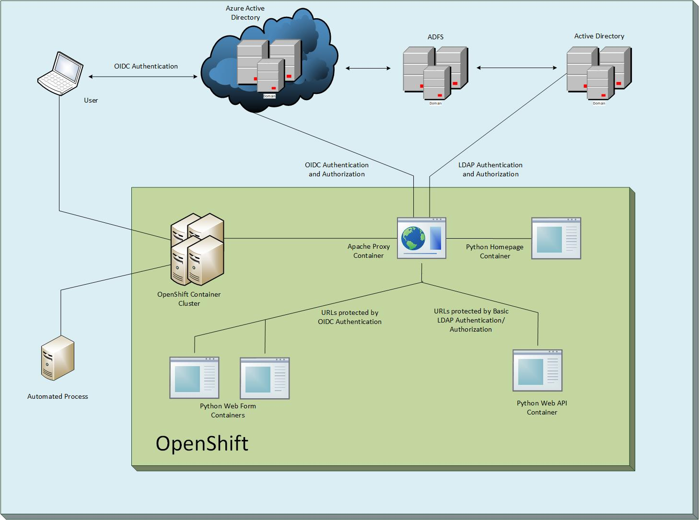
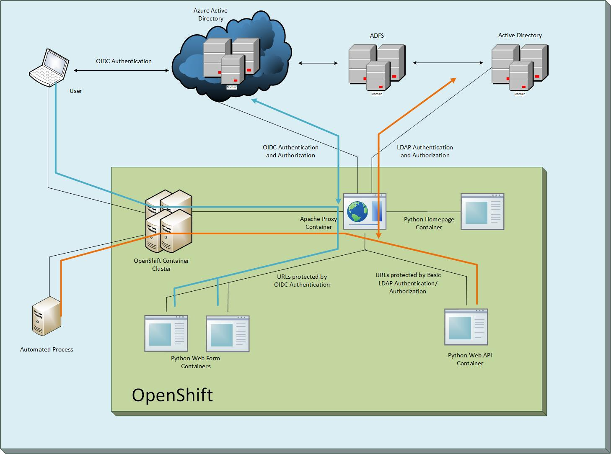

# Flask WebApp
# OpenID Connect (OIDC) Authentication/Authorization for WebApp
### An example of how to use a reverse proxy to provide OIDC authentication in front of an arbitrary web application, while using Azure roles to manage authorization
#### See [Microsoft Page](https://docs.microsoft.com/en-us/azure/active-directory/develop/v1-protocols-openid-connect-code) for more details.

#### This example contains two containers (1) An Apache web server, and (2) a Python application running in Flask.
#### Apache Proxy container in [link](), Flask WebApp in this project

#### Diagram

#### Authentication Flow

